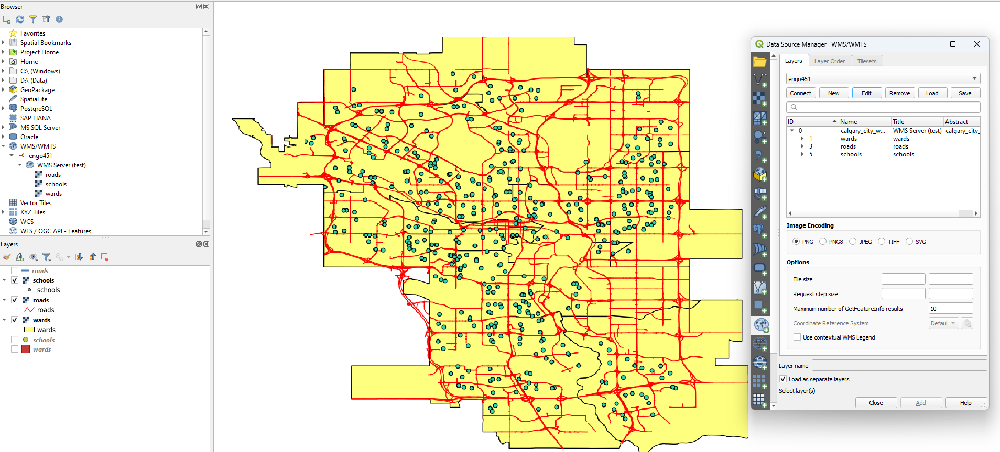
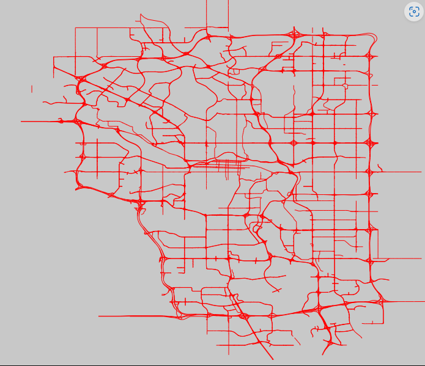
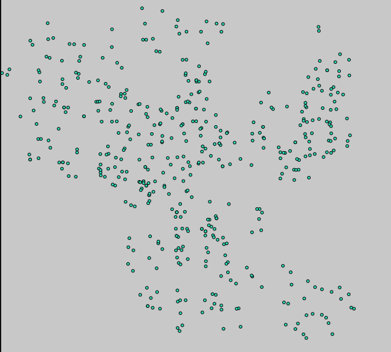
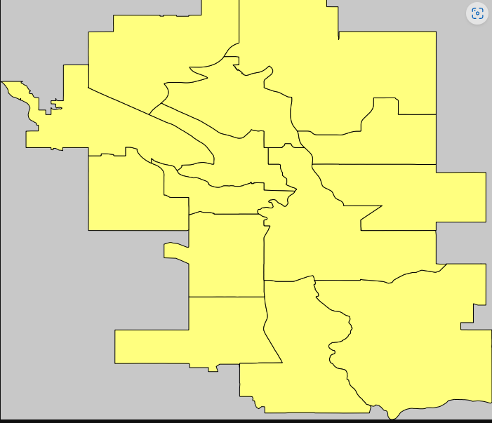

# Geospatial Web Mapping Service (WMS) Application with Leaflet Client

## Project Overview

This project was developed as part of ENGO 641 (Design and Implementation of Geospatial Information Systems) at the University of Calgary. The goal of this assignment was to build a full-stack geospatial application integrating Web Mapping Services (WMS), spatial databases, Python web services, and a Leaflet-based web client.

The system demonstrates:
- Deployment of WMS using MapServer.
- Publication of spatial datasets (schools, roads, wards, and more).
- Web client development using Leaflet.js to visualize and interact with geospatial layers.
- Server-side query processing using Python CGI scripts.
- Integration of CanVec datasets via GeoPackage files.

## Technologies Used

- **MapServer** for WMS service deployment
- **Leaflet.js** for thin client web mapping
- **Python (CGI scripting)** for dynamic SQL queries
- **PostgreSQL/PostGIS** for geospatial data storage
- **ArcGIS Pro** and **QGIS** for data processing and visualization
- **GeoPackage (GPKG)** for data packaging
- **HTML/CSS** for web interface

## Live Access Instructions

Since this project is hosted on the University of Calgary internal server, you need VPN access to view it:

### Step 1: Connect to University of Calgary Network

- Download and install **FortiClient VPN**.
- Use your UCalgary credentials to connect to:
  - **VPN Name:** General UC Networks
  - **VPN Type:** SSL-VPN

### Step 2: Access the Application

Once connected to the VPN, open the following URL in your browser:

👉 [http://10.41.80.45:8080/wmaps/engo451/2023/u52/Assignment_3_SHARMA_AGYAPONG_BANIYA.html](http://10.41.80.45:8080/wmaps/engo451/2023/u52/Assignment_3_SHARMA_AGYAPONG_BANIYA.html)

---

## Project Components

- **WMS Service Setup:** 
  - Mapfile configuration for publishing spatial data layers.
  - Custom symbology and projection settings.
- **Web Mapping Client:**
  - Leaflet.js client integrating WMS layers with multiple basemaps.
- **GeoPackage Analysis:**
  - Downloaded CanVec dataset using Government of Canada’s Geospatial Data Extraction Tool.
  - Extracted hydrographic and transportation features for Calgary region.
- **Dynamic Query Service:**
  - Python CGI script for user-defined queries on GeoPackage datasets.

## Screenshots

## Project done by:

- **Amresh Sharma (30233389)**
- **Isaac Kwabena Agyapong (30222691)**
- **Ujjal Baniya (30232571)**

## Supervisor

- **Prof. E. Stefanakis — Department of Geomatics Engineering, University of Calgary**

---

## License

This repository is for academic demonstration purposes only.

